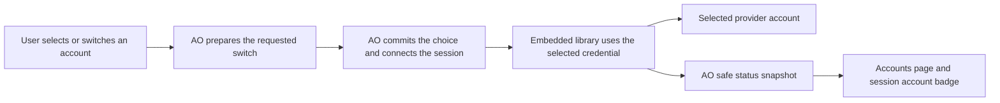

# Accounts Manager specification

Status: proposed specification and staged plan. Account selection is per session; running-response timing remains an open preference. Date: 2026-09-26.

## 1. Objective and product decisions

Make switching between accounts easy and keep credentials ready for use across both supported CLIs. Build on CLIProxyAPI through the embedded runner introduced in PR #5769. The primary success case is a user selecting another saved account and continuing work with minimal effort.

- Users choose an account and may request a different one at any time. AO performs the connection changes, credential refresh, and any required controller restart.
- Switching saved accounts is a first-release workflow, accessible directly from the session. A persisted binding records the user's latest selection and changes when the user requests a switch.
- Credential management includes connecting, reconnecting, naming, checking status, and removing accounts. An expired or exhausted source account must not prevent switching to another usable account.
- A user may save a default for future sessions. Connecting an account or switching an existing session changes that default only when the user explicitly chooses to do so. Automatic fallback and account ranking remain outside this release.
- Fast means few interactions, usable cached choices, and short completion times for local operations. The latency targets below are requirements to measure, not performance already established.

### Required isolation

The required use case is simultaneous independent sessions: session 1 uses account A while session 2 uses account B. Changing session 1 must not change session 2, the device login, or a future-session default. Bulk switching is outside the first release.

Each managed child process receives the local gateway endpoint and a private token scoped to its session and selected account. The gateway owns the actual provider credentials. Credential precedence must be verified against each supported CLI version, including inherited environment, saved settings, and alternative authentication modes; a shell key is not a universal override rule. Normalize only the managed child's connection settings. Never export credentials into the parent shell or rewrite device-global configuration.

### Existing features are protected

The Subscriptions page shown in the supplied screenshot and all existing Codex account-change behavior are outside the modification scope. This is a permanent boundary for this work, not a migration phase.

| Protected area | Boundary |
| --- | --- |
| Subscriptions UI | Do not edit its components, interactions, account actions, or query state. Add a separate Accounts surface. |
| Native Codex account switching | Do not modify its service, session-switch coordinator, credential reconciliation, HTTP behavior, or storage implementation. Do not call its global-switch operation to implement a managed session switch. |
| Existing credentials | Use a separate gateway credential store under AO-owned state. No shared writable credential files, automatic import, or deletion of native account records. |
| Existing contracts and tests | Preserve native API shapes and behavior. Run their existing tests unchanged; add separate integration coverage for coexistence. |
| Shared launch integration | Add a narrow opt-in connection path. Native sessions keep their existing launch path and environment. A gateway failure must not redirect a managed session into that native path. |

Record the protected paths before implementation and check each milestone's diff against them. Current examples include the `CodexAccount*` settings components, `useCodexAccount*` hooks, `codex-accounts-state`, and the backend `codex_account*` and `codex_accounts*` native-account modules. Shared registration changes may add the new feature but must preserve these existing definitions and behavior. If an integration appears to require changing protected code, resolve that design conflict before editing it.

### Remaining product preference

For a running response, the draft recommendation is to finish it before switching and offer **Switch now** to interrupt it. This timing default is not yet confirmed. The requirements below describe both user-selected actions without treating an unanswered recommendation as consent.

## 2. First release scope

| Capability | Required behavior |
| --- | --- |
| Connect | Offer browser sign-in, device sign-in, API key, or credential import only where the provider and installed engine support that method. |
| Organize | Rename accounts, search by label, and filter by provider and state. Labels do not determine identity. |
| Understand | Show authentication state, supported session modes, sessions using the account, and available model or quota observations. |
| Maintain | Reconnect, refresh status, enable, disable, and remove an account with clear consequences. |
| Switch | Select another saved account from the session, see progress, and continue with that account. Include initial selection, explicit defaults, and restore of the latest committed choice. |

Project and workspace defaults, bulk switching, bulk imports, usage history, billing estimates, and automatic account switching are later work. Existing device account controls remain independent and unchanged.

## 3. Account selection contract

1. Show the account beside the selected CLI and model, with a directly accessible switcher. A saved user default may prefill a new session. Without a selection or saved default, require a choice.
2. Validate the target account for the selected provider and session mode. Unknown quota or model observations alone do not prevent an attempt with the selected account. Missing or rejected credentials lead directly to reconnect; a disabled target offers an explicit **Enable and switch** action.
3. Persist the selected account before starting requests through its connection. The request path enforces that selection until the user changes it. Do not require the old account to authenticate successfully before allowing a switch away from it.
4. Restore uses the latest committed choice. Changing a default affects future sessions only. Refreshing credentials preserves account identity and bindings.
5. If the selected account cannot serve a request, make **Switch account** and the relevant recovery action immediately available. AO uses only the account, provider, and model the user has selected.

Programmatic launches follow the same contract: provide an account identifier or use an explicitly saved user default. Never select the first available account. When a session changes CLI, require a selection for that provider or reuse its existing binding.

The interface uses **Default for new sessions** and **Used by N sessions** as separate labels. There is no misleading single global **Active account** label for managed sessions.

### Switching behavior

- The user can request a switch from an idle, busy, rate-limited, disconnected, or expired-account session. Preserve the current conversation where the adapter supports continuing it with the target account.
- During active work, apply the timing the user selects. If switching after the current response, show the pending target and a cancel action, and do not start another response on the old account. **Switch now** explicitly interrupts the current response. Never splice two accounts into one response.
- AO validates the target, stops the old controller when required, commits the new binding, and resumes through the supported adapter. Block new input only while needed to complete that transition; keep other account-management actions usable.
- Until commitment, retain the old binding and display the requested target as pending. After commitment, a resume failure shows the target, the failure, and a direct retry or account-change action. Success means the target is ready to accept input, not merely that its name has changed.
- If the provider requires a new conversation, explain that consequence inline and let the user continue with the selected account in a new conversation using the same workspace. Retain the old conversation. Account switching remains available even when conversation continuation is unavailable.

Changing between terminal and Chat modes follows the same user-choice contract. Preserve the selected account where the target mode supports it. Otherwise, offer the concrete supported path, such as continuing with that account in terminal mode. Using a different native account requires an explicit user choice showing that identity and its scope.

## 4. Main user workflows

### Switch to a saved account

1. Open the account control beside the session's CLI or model. Show cached account choices immediately, including their status and the current selection.
2. Choose the target. An ordinary idle switch with usable saved credentials starts immediately, without opening Settings, signing in again, or an additional confirmation dialog.
3. Show **Switching to [account]**, or the explicitly chosen pending state. Present interruption, wider scope, or a new-conversation consequence before the user commits to that action.
4. AO completes any necessary refresh or restart. The user should not copy tokens, edit configuration files, or manually relaunch the CLI.
5. Show the committed account when it can accept input and restore composer focus. On failure, keep a clear recovery action in the same place, with the actual current and requested accounts distinguishable.

The ordinary saved-account path takes two actions: open the switcher and choose an account. Reconnect and account creation are available inside that flow when needed. Show that the action affects this session; changing the default for future sessions is a separate action.

### Connect an account

1. Open **Settings > Accounts**, choose **Add account**, and select a provider.
2. Show supported connection methods inline. Browser or device authorization displays progress, cancellation, and an expiry state.
3. Verify the returned credential before showing success. A cancelled or expired operation must not create a usable account later through a delayed callback.
4. Show the new account immediately and return focus to its row. Offer separate actions to use it in a session or make it the default.

Treat provider identity and workspace or organization context as identity evidence where available. Matching email addresses alone never justify merging accounts or replacing credentials. Reconnect updates an existing account only after verifying the intended identity; a different identity becomes a separate connection choice.

### Browse and refresh

- Render the cached list immediately and refresh in the background. Keep the last valid snapshot visible if the engine is unavailable.
- Each row shows its label, provider, authentication state, default marker, and session count. Put detailed models and quota in an expandable area.
- Show freshness separately from state: **Checked 2 minutes ago**, **Refreshing**, or **Status unavailable**. Unknown remaining quota must never appear as zero.
- A refresh affects the relevant row. Repeated refresh clicks share the same pending operation, and a slow account does not block other rows.
- Support keyboard navigation, visible focus, accessible progress announcements, and stable row positions while updates arrive.

### Maintain an account

| Action | User-visible result and session impact |
| --- | --- |
| Rename | Update the label without reconnecting or changing bindings. |
| Set default | Save the user's selection for new sessions only. Show saved state after persistence succeeds. |
| Reconnect | Refresh the credential for the verified identity while retaining the account identifier. |
| Disable | Prevent new launches and subsequent requests through that account. If sessions use it, explain the impact before confirmation. An existing response may finish; subsequent work is blocked. |
| Remove | Show affected managed sessions and provide direct actions to switch or stop each one. Fence new launches through the account, then delete only its gateway credential after the required work and confirmation complete. Unresolved bindings on stopped sessions require a new choice on restore. Clear any managed default referencing the removed account. |

Enabling an account lifts the user's disable flag; authentication and cooldown checks still apply. Removal is local credential removal; it must not claim to revoke a provider login unless an explicit supported revocation operation succeeds. Repeated mutations use operation identifiers so retries cannot duplicate work.

### Credential lifecycle gates

- Add: keep credentials pending until verification and operation completion succeed. Cancellation, expiry, and repeated callbacks cannot publish a usable account afterward.
- Reconnect: verify the intended identity before replacing the saved credential. Keep the prior credential intact if replacement fails; avoid competing refresh and reconnect writes.
- Remove: serialize deletion with refresh and reconnect, revoke the account's managed routes, and remove it from the gateway's active registry. A delayed worker or file reload must not recreate the deleted account.
- Recover: journal incomplete operations and resume or clean them up after a restart. A retry must not duplicate an account or delete a different credential.
- Isolate: adding, reconnecting, or deleting a gateway account must leave Subscriptions, native account records, native credential files, and unrelated sessions unchanged.

## 5. Performance requirements

Measure these targets in a release desktop build on a recorded reference machine with at least 4 CPU cores, 16 GB RAM, and SSD storage. Use 50 saved accounts and 20 session bindings. Report p50 and p95, with at least 100 samples for warm interactions and 30 cold starts.

| Interaction | Target | Measurement boundary |
| --- | --- | --- |
| Button or search feedback | p95 <= 100 ms | Input event to visible response, including a pending indicator where needed. |
| Open the saved-account switcher | p95 <= 200 ms | Input event to a usable list of cached account choices. A spinner alone does not satisfy this target. |
| Open Accounts with a warm daemon | p95 <= 200 ms | Navigation to a usable cached account list. |
| Save a local label or default | p95 <= 300 ms | Submit to confirmed persistent result rendered. No provider call required. |
| Reflect an account update | p95 <= 500 ms | Daemon accepts the new snapshot to the changed row being painted. |
| Prepare an already authenticated session route | p95 <= 100 ms | Validate and persist the selected binding, then prepare the child connection. Excludes process startup and remote token refresh. |
| Complete a warm idle switch without restart or remote refresh | p95 <= 300 ms | Choose target to committed account and input-ready session. Apply only to adapters that support this path. |
| Added gateway latency | p95 <= 25 ms | Additional time to first response event against the same controlled streaming upstream, compared with direct access. Include authorization and protocol conversion. |

Cold startup must show the Accounts shell and initialization state within 300 ms of navigation. Target a usable local snapshot within 1 second of daemon readiness. Never show an empty-account message while initialization is still pending.

Login, provider checks, token refresh, and controller restart have separate completion costs. Acknowledge the action within 100 ms, show the current stage, and handle deadlines explicitly. Measure the full account-switch duration and report time waiting for the current response, remote authorization, and local controller restart separately. Target p95 <= 2 seconds for the local restart and reconnect stage; external waits must remain visible in the full measurement. Use a 10-second deadline for a status check; login expiry follows the authorization flow. Test status checks against an unavailable provider to prove the page stays interactive.

### How to meet the targets

- Keep a daemon-owned safe snapshot. Account list reads must not synchronously scan credential files, start CLIs, or contact providers.
- Reuse one supervised engine process. Account mutations use supported reload mechanisms instead of restarting the runner per operation. The upstream watcher supports incremental credential changes. [Watcher documentation](https://raw.githubusercontent.com/router-for-me/CLIProxyAPI/v7.3.8/docs/sdk-watcher.md)
- Publish versioned account updates through the existing event infrastructure. Coalesce repeated updates by account, discard older revisions, and resync from a full snapshot after reconnect or a detected gap.
- Deduplicate concurrent checks for the same account and cap independent provider checks at four. Refresh on meaningful events or explicit user actions; avoid continuous per-row polling.
- Update only affected rows. Optimistic labels may roll back on error; login success, account removal, and session selection must reflect confirmed backend state.

## 6. Library and AO responsibilities

Embed the pinned upstream SDK inside AO's supervised runner. Keep the vendored engine unchanged where its extension points cover the requirement. The SDK already exposes authentication lifecycle, background refresh, and request handling, with hooks for access control and runtime managers. [SDK guide](https://raw.githubusercontent.com/router-for-me/CLIProxyAPI/v7.3.8/docs/sdk-usage.md), [builder extension points](https://raw.githubusercontent.com/router-for-me/CLIProxyAPI/v7.3.8/sdk/cliproxy/builder.go)

| Area | CLIProxyAPI provides | AO must provide |
| --- | --- | --- |
| Credentials | Supported login flows and token refresh mechanics. | User intent, operation lifecycle, identity checks, protected persistence, and recovery UI. |
| Requests | Provider transport, protocol conversion, and streaming. | User-requested switching, exact account binding, child connection configuration, and truthful mode support. |
| Account changes | Credential registration and reload machinery. | Stable public identifiers, names, defaults, and mutation rules. |
| Observations | Models, errors, cooldowns, and available quota signals. | Safe cached projections, freshness, and actionable status. |
| Operations | Embedded service lifecycle and SDK hooks. | Runner supervision, compatibility checks, private management access, and performance measurement. |

Use a single-account selector and account-scoped access checks at the runner boundary. Default scheduling, round-robin, and session affinity with failover must not broaden the authorized account. A retry may use the same account only when the protocol permits it; never automatically replay a partially delivered response or an operation with an ambiguous outcome.

Quota display must use provider observations with their original timestamps and units. Keep quota freshness separate from cooldown and authentication state. The upstream management source explicitly separates passive quota observations from scheduler state. [Quota projection source](https://raw.githubusercontent.com/router-for-me/CLIProxyAPI/v7.3.8/internal/api/handlers/management/auth_files.go)

## 7. Data, API, and protection requirements

- Persist account identifiers, user labels, enabled state, explicit defaults, session bindings, and switch-operation facts needed for recovery. Derive display state from current facts. Keep transient quota observations and raw provider responses out of durable session metadata.
- Return a narrow account snapshot with a revision, safe identity display, supported actions, observation timestamps, and recoverable error codes. The renderer never calls upstream management routes directly.
- Scope every mutation to an account or login operation. Use revision checks for conflicting changes and idempotency for retryable writes. Tie route authorization to a binding revision and invalidate the old route when the user changes accounts. Revalidate at execution time so deletion or disablement cannot be bypassed by an old route credential.
- Keep credentials, route tokens, private filenames, and management keys out of public API responses, UI event payloads, logs, argv, and persisted runtime metadata. Internal authenticated runner-to-daemon messages may deliver connection secrets to the private child-launch mechanism.
- Protect every credential write, including imports and refreshed tokens. Encryption at rest is a release requirement to implement and verify at the storage boundary; vendoring the library does not establish it. Use private directory permissions and bounded, cleaned-up staging for any necessary plaintext import material.

All AO-owned state stays under the configured AO data root. The runner stays on `127.0.0.1`; its management key is private to the daemon. Accounts Manager control routes remain inaccessible from mobile or LAN listeners. Preserve the daemon's existing listener policy.

The runner must independently reject unsupported configuration, including request-body logging, file logging that may contain secrets, remote management, profiling, discovery, and plugins. Sanitized operational events may contain operation IDs, safe account IDs, durations, and error codes, without prompts or credentials.

## 8. PR baseline and required changes

Baseline reviewed: PR #5769 at `6f064d626d55dd5aa1c7996c06a1349a73198460`, embedding CLIProxyAPI `v7.3.8`. These are source and description observations, not a claim that the full release suite passed. The current checkout still documents the separate [device-global account design](../research/2026-08-31-codex-global-account-management-architecture.md).

| Reviewed PR baseline | Spec requirement |
| --- | --- |
| Embedded runner, account operations, Settings page, and safe projections exist. | Reuse them and measure the interaction targets. |
| Provider policy selects from a preferred account and ordered fallbacks before pinning. | Accept one explicit user selection or saved default. Remove automatic fallback from the first release workflow. |
| Pins survive restore; already pinned sessions do not fall back. | Remember the latest user choice across restore and let the user change it directly. |
| Per-spawn selection and manual repinning are deferred. | Add initial selection and saved-account switching as first-release workflows. |
| Native device configuration remains separate. | Preserve the existing implementation without migration or shared writable credentials. Explain which account each session mode uses. |

### Session mode coverage

| Surface | Reviewed PR state | Release behavior |
| --- | --- | --- |
| Codex terminal | Gateway integration present. | Offer managed accounts after end-to-end verification. |
| Codex Chat | Uses the native device account. | Show the actual account source and a direct route to a supported managed session. Managed switching here requires a verified integration. |
| Second CLI terminal | Gateway integration present. | Offer managed accounts after end-to-end verification. |
| Second CLI ACP Chat | Gateway integration present. | Verify account identity, streaming, tools, and resume before exposing support. |

Use the application's existing provider names in the interface. A shared Accounts page does not imply every session mode already supports managed accounts.

Existing users opt in to the separate Accounts feature. Do not import credentials, change device defaults, rewrite native config, or rebind existing sessions automatically. The existing Subscriptions surface and native Codex account-change implementation remain untouched. Migrating or replacing them is outside this task.

## 9. Failure behavior

| Condition | Required response |
| --- | --- |
| Login cancelled, expired, or denied | Keep a retry action; discard pending authorization state; ignore late completion. |
| Selected account needs login or is disabled | Show **Reconnect**, **Enable**, or **Switch account** as appropriate. The source account's problem must not prevent selecting another usable account. |
| Rate limit or cooldown | Make **Switch account** directly available and show the available retry time. The user chooses whether to wait, retry, or change accounts. |
| Engine crashes or is incompatible | Preserve the last safe snapshot and mark it stale. Block affected launches and mutations; keep unrelated AO features usable. |
| Daemon or desktop restarts | Reconcile operations and credentials, retain bindings, and rebuild observations without inventing an account choice. |

The supervisor may restart the same engine with bounded backoff. It must not convert a gateway failure into a native-account launch. An interrupted stream surfaces its interruption; runner recovery never implies permission to replay completed work.

## 10. Staged delivery and acceptance

Implement one reviewable stage at a time. Record its changes and verification before continuing. This plan does not authorize application-code changes or publication.

| Stage | Scope | Gate before proceeding |
| --- | --- | --- |
| 1. Protect the baseline | Inventory protected paths, map the additive launch boundary, and record existing Subscriptions and native account-switch behavior. | Existing checks and real desktop flows have a recorded baseline; any pre-existing failures are identified without unrelated fixes. |
| 2. Prove the isolated credential lifecycle | Embed the pinned library behind the separate runner and credential store. Implement add, cancel, reconnect, refresh, and delete without involving native account code. | The lifecycle gates above pass, including restart recovery, deletion during refresh, and encrypted persistence. |
| 3. Prove simultaneous account isolation | Configure two managed child processes with separate account capabilities and verify credential precedence for each supported CLI version. | Session 1 uses A and session 2 uses B concurrently. Conflicting inherited credentials, retries, tools, and restore cannot cross those bindings. Native launches are unchanged. |
| 4. Add the new controls | Build the separate Accounts page and session picker; implement user-requested switching and any necessary controller restart. | Add/delete and the ordinary two-action switch work in the real desktop app. Switching session 1 leaves session 2 and device authentication unchanged. |
| 5. Verify coexistence and speed | Run regression, packaging, restart, and performance checks with the feature both off and on. Capture the actual desktop workflows. | Existing Subscriptions and native switch checks still pass unchanged, protected code has no edits, and the new feature meets its acceptance and latency targets. |

Keep the feature opt-in throughout rollout. Do not enable the next capability or advance a stage while its correctness gate is failing. Codex Chat gateway support is a separate compatibility milestone and must not be implemented by changing the protected native account-switch path.

### Acceptance gates

- Two simultaneous sessions can use different accounts. Changing one session's selection affects only that session; later requests and restore use its latest committed choice. A failed switch never displays the target as ready.
- An expired, disabled, exhausted, or disconnected A does not prevent the user switching to usable B. Without a user-requested switch, those conditions never cause AO to choose B.
- Connecting or reconnecting an account does not change a default or another session's binding. Renaming preserves identity; duplicate email addresses cannot silently merge accounts.
- Switching respects the session boundary and user-selected running-response timing. Cancellation, controller restart, mode changes, and a required new conversation show their consequences. Defaults affect only new sessions.
- The normal saved-account switch takes two actions, and usable-picker, switch-completion, and gateway performance targets hold with the reference workload. Record measured results separately from targets.

Login, imports, refresh writes, APIs, events, diagnostics, and restart recovery must also pass credential-protection checks. Run the relevant runner, backend, and frontend suites plus API drift and desktop integration checks before calling the implementation complete. Verify both the untouched native feature and the new feature in the same build; a clean protected-file diff alone is not evidence of regression-free behavior.

This document defines proposed behavior only. It does not change the PR, implement account management, or establish runtime compatibility or measured performance.
