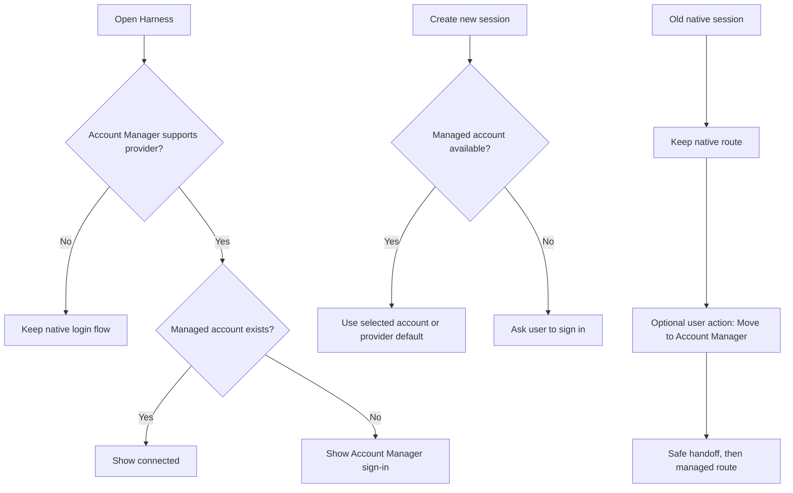

# Managed provider backward-compatibility plan

## Goal

Move Codex and Claude to Account Manager for all new work without breaking
conversations that were created before Account Manager was introduced.

The change is provider-specific. It does not change providers that Account
Manager does not support.

## Update, 10 October: older chats are moved automatically

This replaces the "optional, user-triggered" move below for **chat** sessions.
Terminal sessions are unchanged: an older terminal session keeps its native
account, and moving those is separate work.

**The rule.** A Codex or Claude chat that has no account is given the provider's
default account at the moment its provider process is launched. That is the only
place a session is adopted, and it runs only when a new process is started, never
when AO finds a running one again.

**The restart.** A chat whose old process is still running cannot be given an
account, so AO restarts it once: it stops the process while the chat is doing
nothing and starts it again, which resumes the same conversation on the account.

- It runs in the background, a few chats at a time, starting shortly after AO
  starts. It never delays startup.
- A chat is left alone while it has a running or queued turn, a pending
  question, compaction or background work, and while it is changing interface
  or agent. AO tries again every 30 seconds until no chat is running without
  an account.
- It does not wait for the chat to be closed. An open chat shows the agent
  being restored for a few seconds; a draft is kept and a message sent meanwhile
  is queued and delivered.
- Orchestrator chats are included.
- A chat that is asleep or stopped is not restarted. It is adopted when it next
  starts.

**The account.**

- This computer's own sign-in is imported before any chat is restarted, and
  becomes the default if the provider has none.
- With no account for the provider, the chat is still restarted and waits: it
  is pointed at the account helper, cannot fall back to the native sign-in, and
  is given the first account that is added.
- A default that needs a new sign-in is still assigned. The chat works again
  once that account is signed in to.

**Failures.**

- If the account helper cannot be reached, no chat is restarted.
- If a chat cannot be started again it stays asleep and wakes the usual way.
- An adoption that was written down but not yet sent to the helper holds that
  chat's launch, so a chat never reads as managed while running on the native
  sign-in.

**Consequences.**

- A moved chat cannot change agent between Codex and Claude, like any managed
  session.
- A moved chat does not go back to the native sign-in.
- `AO_LEGACY_CHAT_MIGRATION_OFF=1` turns the move off; chats without an account
  then keep their native sign-in.

**This computer's API key.** The API key the computer's own agent is set up to
use is imported as an account too, with the address it is used against, and is
marked Global like the imported sign-in.

- Claude Code: the key or gateway token in its environment or its own
  settings, with its base URL. A subscription token is a sign-in, not a key, and
  Bedrock, Vertex and Foundry have no key AO could carry.
- Codex: the key Codex is signed in with, from its own auth file. A key kept in
  the environment for other tools is not what Codex uses and is left alone.
- A key found beside a sign-in becomes the default, because the agent itself
  uses a key ahead of a sign-in.
- A key is imported once. Removing the account, signing it out or choosing
  another default afterwards is not undone. A different key takes the place of
  the one imported before, in the same account.
- A key that was already added by hand stays that account and is not marked.

## Final decisions

- Codex and Claude are managed providers.
- The Harness page checks only Account Manager for those providers.
- A native login does not count as “logged in” once the provider is managed.
- If no managed account exists, Harness shows **Sign in through Account
  Manager**, even when native credentials are still present.
- The first successful managed login becomes that provider’s default account.
- Every new session for a managed provider uses a managed account. It uses the
  provider default unless the user chooses another managed account.
- Terminal sessions created before this change keep using their native
  account. Chats are moved; see the update above.
- Native credentials are kept internally so those older sessions can continue
  after restart. They are no longer offered as a new-session login path for a
  managed provider.
- Moving an old native terminal session is optional and user-triggered. Old
  chats are moved automatically; see the update above.
- If all managed accounts are signed out or removed, new managed sessions ask
  the user to sign in again. They never silently fall back to native login.
- Codex and Claude keep separate account lists and separate defaults.
- Providers outside Account Manager keep their current native behavior.

## What the user sees

### Harness

For Codex or Claude:

1. Ask the daemon whether a managed account exists.
2. If one exists, show the provider as connected.
3. If none exists, show **Sign in** and open Account Manager sign-in.
4. Do not show a native login button or use native auth as a fallback.

For an unsupported provider, keep the existing native status and login flow.

### New session

When the user starts a new Codex or Claude session:

1. Check the managed account list.
2. Use the selected managed account, or the provider default.
3. If no managed account is signed in, stop before launch and show the Account
   Manager sign-in action.

The session must never accidentally inherit the machine’s native account.

### Existing native session

This section describes terminal sessions. For chats, see the update above.

An older session keeps its original native route, including after AO restarts.
Its history and normal controls remain available.

The session may show **Move to Account Manager**. If the user chooses it, AO
waits for a safe handoff, starts the same conversation with a managed account,
and keeps the old native route untouched until the handoff succeeds.

### Account changes

Changing a provider default affects new sessions and the next request of
managed sessions according to the existing Account Manager switch rules.
Older native sessions are outside that system and are not changed silently.

Signing out or removing a managed account follows the current transfer and
replacement-default rules. Older native sessions are unaffected.

## Implementation plan

### 1. Define the adoption boundary in the daemon

- Treat the presence of Account Manager state for a managed provider as the
  source of truth for new sessions.
- Reuse the existing provider-account state and empty-primary behavior where
  possible; add a new durable field only if the current state cannot clearly
  distinguish “never adopted” from “adopted but currently signed out.”
- Keep the native authentication records needed by older sessions, but mark the
  managed route on every new session created after adoption.
- Keep Codex and Claude independent.

### 2. Return one clear provider status to the UI

Add or adjust the daemon response used by Harness so it can say:

- managed provider with an available account;
- managed provider with no account and sign-in required;
- unsupported provider using native auth.

The response must not expose credentials or provider-private data.

### 3. Change Harness behavior

- For Codex and Claude, render only the managed status and managed sign-in
  action.
- Keep a small explanation when native credentials exist but no managed account
  exists: “Native login is available, but Account Manager is required for new
  sessions.”
- Remove the native login action from these managed-provider cards.
- Leave other provider cards unchanged.

### 4. Make session creation choose the correct route

- At session creation, resolve the provider’s managed account before spawning.
- Attach the existing managed proxy route/ticket to a managed session.
- Mark pre-feature sessions as native and preserve their current launch path.
- Reject a new managed session with a friendly sign-in-needed error when no
  managed account exists.
- Do not use native credentials as an automatic fallback.

### 5. Add the optional old-session migration action

- Expose whether a session is an older native session.
- Show **Move to Account Manager** only for that case and only when a managed
  account is available.
- Reuse the existing safe handoff/recovery path: wait for an idle boundary,
  create the managed route, resume the same conversation, and report a clear
  success or retry message.
- Keep the old native session if any step fails.

### 6. Keep account changes consistent

- A first managed login sets the provider default.
- Default changes continue to affect managed sessions under the existing
  request-switching rules.
- Account sign-out/removal continues to transfer eligible managed sessions to
  the default account or leave them waiting for a new login when no account
  remains.
- Native sessions are never included in managed-account counts or transfers.

### 7. Update copy and remove conflicting guidance

Replace messages that say “existing sessions keep their account” when they are
describing managed sessions. Use separate wording for:

- managed sessions, which follow the account-switching rules;
- old native sessions, which keep their native account until the user migrates
  them.

## Tests

### Backend

- Managed provider with a managed account reports connected.
- Managed provider with only native credentials reports sign-in required.
- Unsupported provider still reports native login state.
- First managed login becomes the default.
- New session uses the managed default.
- New session can use a selected managed account.
- New managed session is rejected when no managed account exists.
- Old native session keeps its native launch route after restart.
- Managed account changes do not rewrite old native routes.
- Optional migration succeeds at a safe boundary and preserves the old route
  when it fails.
- Sign-out/removal transfers only managed sessions.
- Removing the last managed account blocks new managed sessions without
  affecting old native sessions.
- Codex and Claude state remain independent.

### Frontend

- Harness shows Account Manager sign-in when native login is the only login.
- Harness does not show native login for Codex or Claude.
- Unsupported providers keep their current native controls.
- New-session UI offers only managed accounts for Codex and Claude.
- Old native sessions show the optional migration action.
- User-facing errors contain an action, not internal routing details.

### End-to-end acceptance checks

1. Start with only a native Codex login. Harness asks for Account Manager
   sign-in; an old Codex chat still opens.
2. Add a managed Codex account. It becomes default; the next new chat uses it.
3. Add a second managed Codex account and choose it for one new chat. Other new
   chats use the default.
4. Sign out all managed Codex accounts. New chats ask for Account Manager login;
   the old native chat still works.
5. Repeat the same checks for Claude.
6. Confirm an unsupported provider is unchanged.

## Completion criteria

The work is complete when:

- no new Codex or Claude session starts through native auth;
- old native sessions continue across an AO restart;
- the Harness page gives the same answer as the managed account list;
- no managed-account operation changes an old native session silently;
- the optional migration is safe and reversible on failure;
- the backend, frontend, and end-to-end tests above pass without network calls
  in unit tests.

