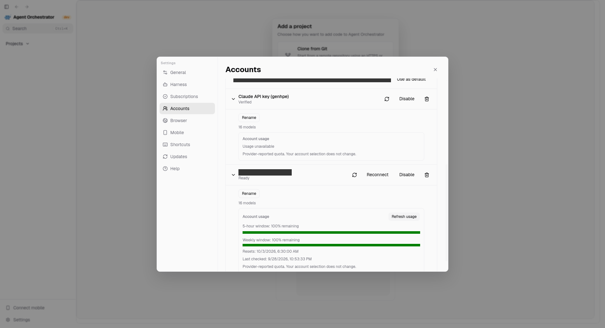
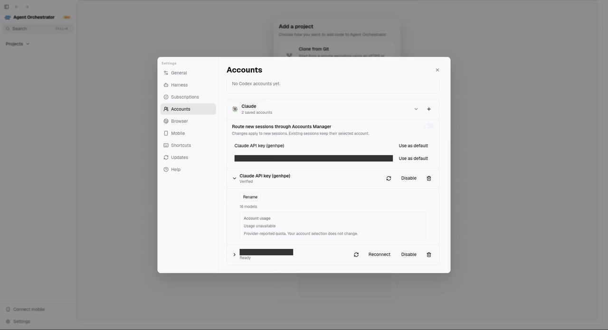

# Native desktop evidence

Captured on 2026-09-28 from the actual Electron app in the isolated desktop lab. The renderer had the native preload bridge and a real provider catalog. Personal account labels were hidden only during capture. Requests and displayed product state were not mocked.

- [Account inventory](accounts-overview.png): saved accounts, explicit default choice, native settings navigation, and an honest unavailable-usage state.
- [Provider-reported usage](accounts-usage.png): two quota windows and their reset/observation times.
- [Refresh recording](accounts-usage-refresh.mp4): 3.8 seconds of the real expand and refresh interaction.
- [Inline recording](accounts-usage-refresh.gif): the same recording in an embeddable format.

The initial quota lookup and explicit refresh both returned HTTP 200. The displayed fractions matched the public response. Account IDs, credential generations, enabled state, and routing choices were identical before and after the interaction.

This evidence covers inventory and usage lookup. It does not certify setup-token quota support, simultaneous live-account routing, account switching, deletion recovery, or native platform acceptance.

