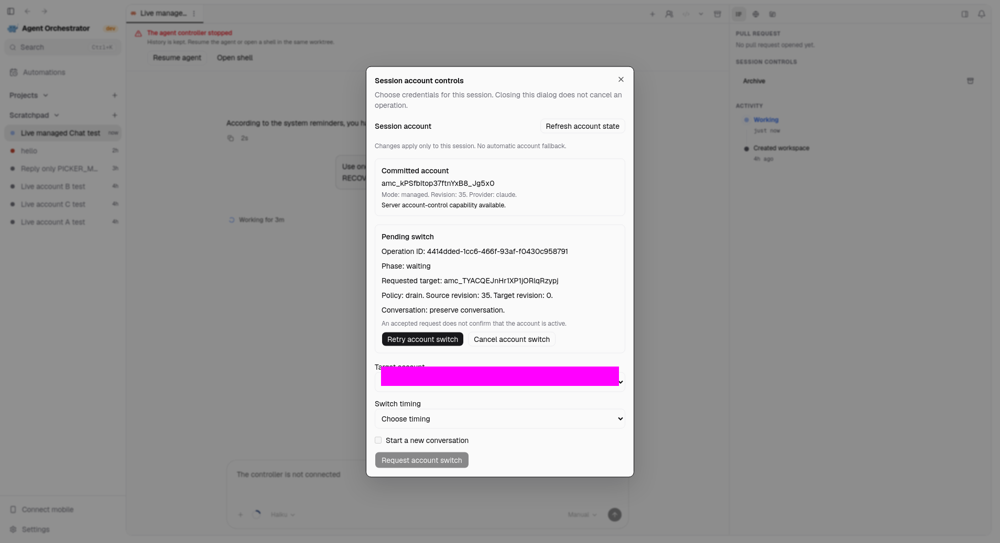
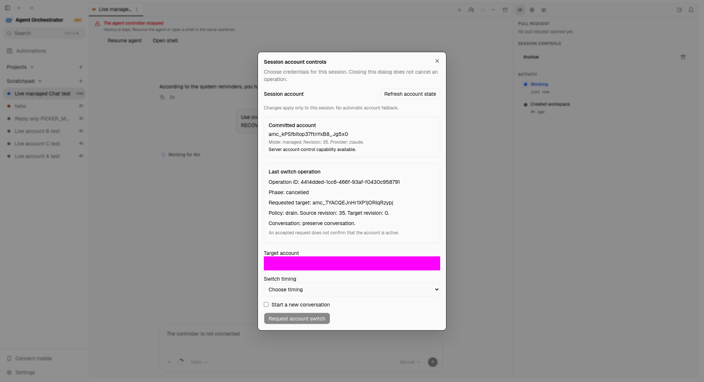
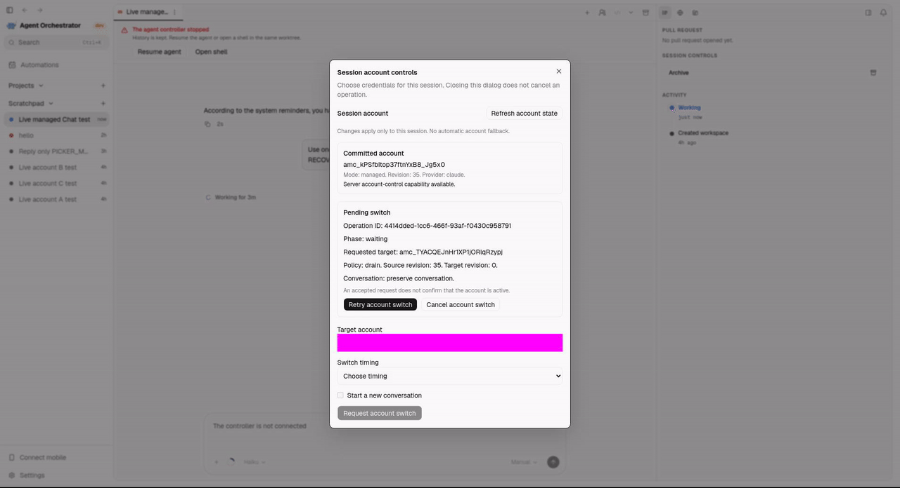

# Draft checkpoint: cleanup and recovered-switch controls

This checkpoint is published at the user's explicit request. It is not production clearance. Historical seal documents describe their state before publication; their source and evidence remain unchanged.

## Changes

- Preserve requested/waiting switch intent when the manager shuts down before source stopping.
- Expose server-observed retry availability through the public API, CLI and desktop controls. Retry still uses the existing durable admission checks; a visible action is not authorization.
- Remove 222 unused upstream standalone files containing 31,612 lines, with exact recoverable archives. Drop 42 obsolete engine requirements while retaining runtime dependencies, licenses and relevant regressions. Add verification for both nested Go modules.
- Record the remaining production work in [REMAINING.md](REMAINING.md), with the detailed [specification](SPEC.md) and [implementation plan](PLAN.md).

## Verification and limits

The immutable shutdown and retry-control snapshots passed focused race repetitions, complete affected package reruns, production direct/fallback process checks, frontend typechecks and the full frontend suite (5,647 passes, seven existing skips). Retained intermittent fixture failures and their successful unchanged-source reruns remain documented in [SHUTDOWN-REVIEW.md](SHUTDOWN-REVIEW.md) and [RETRY-CONTROLS-REVIEW.md](RETRY-CONTROLS-REVIEW.md).

The cleanup passed complete runner ordinary/race suites (297 leaves each), the ordinary engine suite (9,952 leaves, eight existing skips), backend/module build/vet, configured runner lint, workflow lint, five runner cross-builds and packaging. The normalized Linux runner executable is byte-identical before and after cleanup. All 91 protected paths, five guest-design files and the two earlier source seals remain unchanged. Exact evidence is in [CLEANUP-REVIEW.md](CLEANUP-REVIEW.md).

The engine race suite still fails one media-channel assertion reproduced three times on untouched source. Five positive retirement assertions across three recovery groups remain open. Native Windows, both native Mac architectures, full live-account/restart/revocation workflows, current-main integration and independent final review remain release gates. Cross-compilation does not establish native execution. The three bounded source reviews are pending, not implicitly cleared by this push.

## Real desktop evidence

These captures come from the isolated Electron checkout at the exact retry-control source snapshot. The target-account selector is masked at capture; the surrounding application and daemon observations are real. No credentials or private endpoints are shown.

The recording contains the original 16 captured frames, converted from the retained MP4 into a browser-displayable GIF. The observed flow proves restart persistence, recovered Retry visibility and pre-stop cancellation with the source revision and five unrelated bindings preserved. It does not prove live target Retry execution, exactly-once external requests, permanent account removal or cold runner/vault recovery. Explicit Chat resume was checked separately; automatic resume is not claimed.

The cleanup itself changes no visible application behavior. The attached evidence covers the separate retry-control change included in this checkpoint. The PR remains draft; there is no merge or release publication.
