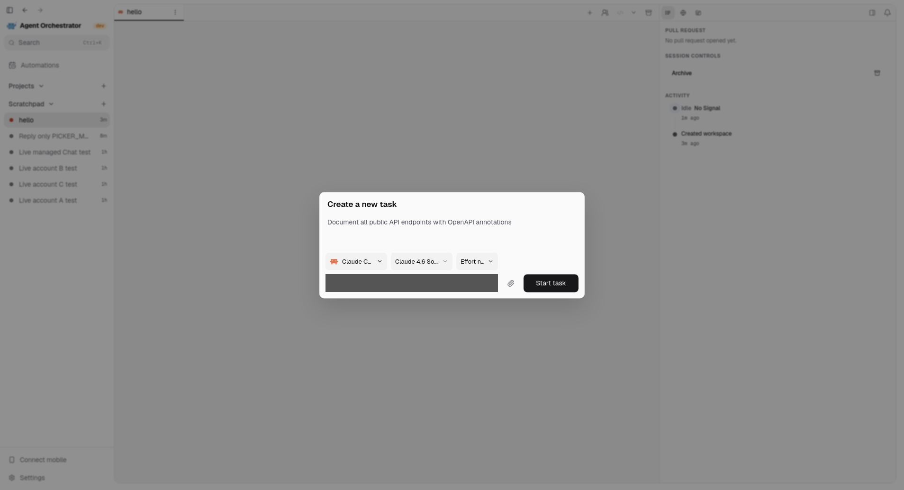
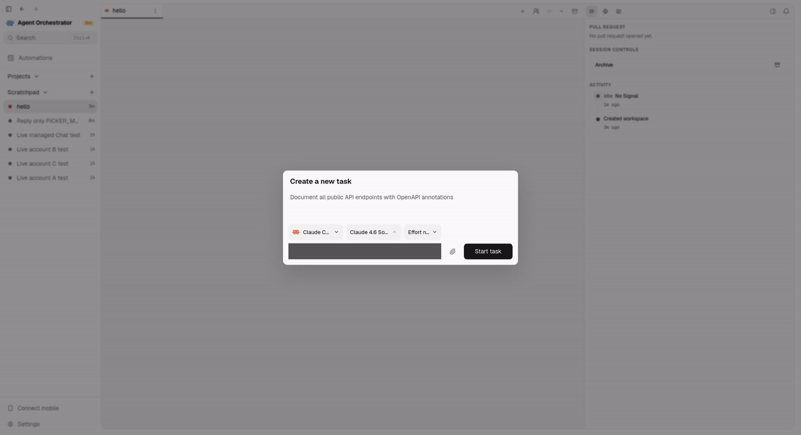

# Testing handoff evidence

This is a draft update, not release approval. The product correction remains byte-identical to the 31-file picker snapshot documented in [ACCOUNT-PICKER-REPAIR.md](../ACCOUNT-PICKER-REPAIR.md).

## Tester entry point

[Windows, macOS and Linux testing guide](../../../testing/accounts-manager.md). The guide separates everyday testing, negative controls and maintainer-only destructive acceptance. Native Windows execution and native Mac arm64/x64 containment are not locally verified. The known deletion, restart and integration blockers remain open.

## Current desktop captures

Captured 2026-09-29 at 16:28 UTC from the actual isolated Electron app with a real provider catalog. The renderer source for the shown controls was compared with the current worktree before capture. Opening model and effort menus did not submit a task, change a saved account or switch a running session.

Personal account text is covered during capture. The background terminal is hidden during capture because it contains private connection details. No replacement account labels, quota readings or responses are invented. The surrounding desktop interface remains visible. The recording preserves observed frame timing, encoded at eight frames per second and 1200 pixels wide for size, and lasts 4.26 seconds.

These captures verify layout and menu interaction only. They do not prove Windows/macOS execution, account removal, billing attribution or crash recovery. The earlier [actual-account results](../parallel-session-delivery/user-flow/LIVE-RESULTS.md) and picker report record the separate bounded live checks.

## Verification for this update

- The prior 31-file source manifest matches every current byte. Its full frontend result was 5,632 passed and seven skipped; shared UI was 134 passed; the four affected backend packages passed their full race suites. Final logs were re-read; those full suites were not repeated for this documentation-only follow-up.
- Fresh focused race checks passed in `accountsmanager`, `service/accountsmanager`, `httpd/controllers` and `session_manager`, using the picker/model test selection from the guide. No product source was changed during this follow-up.
- Guide links, command/source review, whitespace, all 91 current protected-path hashes and all five guest-design hashes pass. An initial comparison used a superseded pre-main-integration manifest; the correct current sealed baseline passes, and the affected file is unchanged from the published head.
- A pinned offline secret scan of the prepared changed source reported no leaks. No login material, runtime directories, test profiles or unredacted captures are included in the publication set.
- The guide was opened in the session preview. Windows and macOS launch commands were reviewed against the current scripts, not executed on native machines.

Local preparation logs: `/var/tmp/pr-5769-testing-guide-79.nlPeub`. Earlier picker verification: `/var/tmp/pr-5769-account-picker-79.wFVwLz`. These local paths are provenance, not reviewer-accessible links; the guide and captures above travel with the branch.

Publication still requires the user's approval of the exact push and PR-description update. Keep the PR as a draft. No merge, release, force push or native-platform certification is included.
