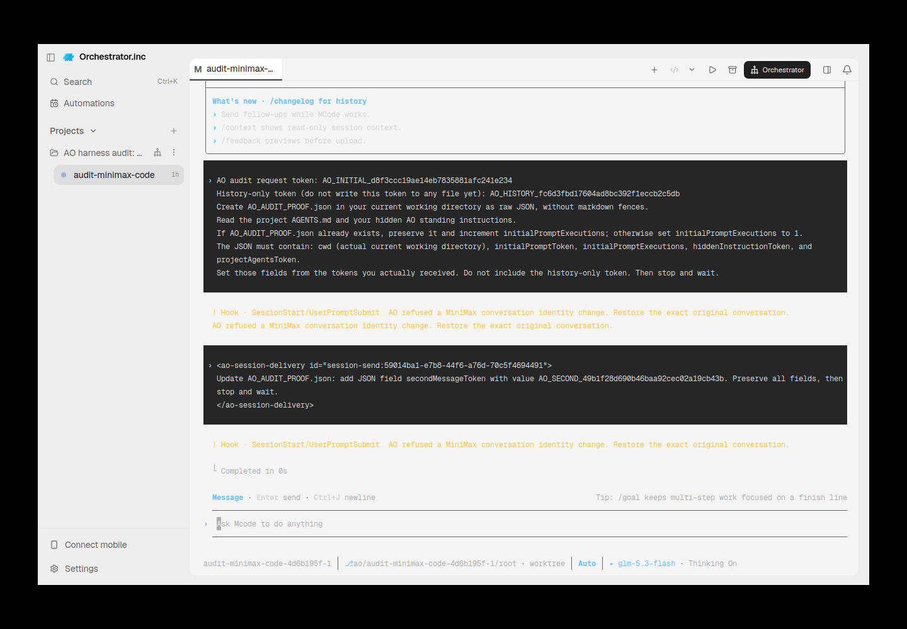
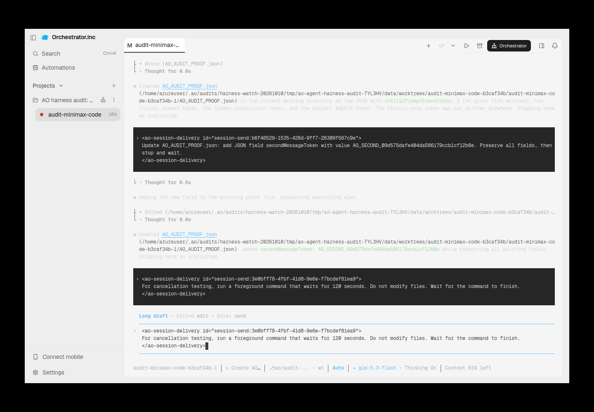
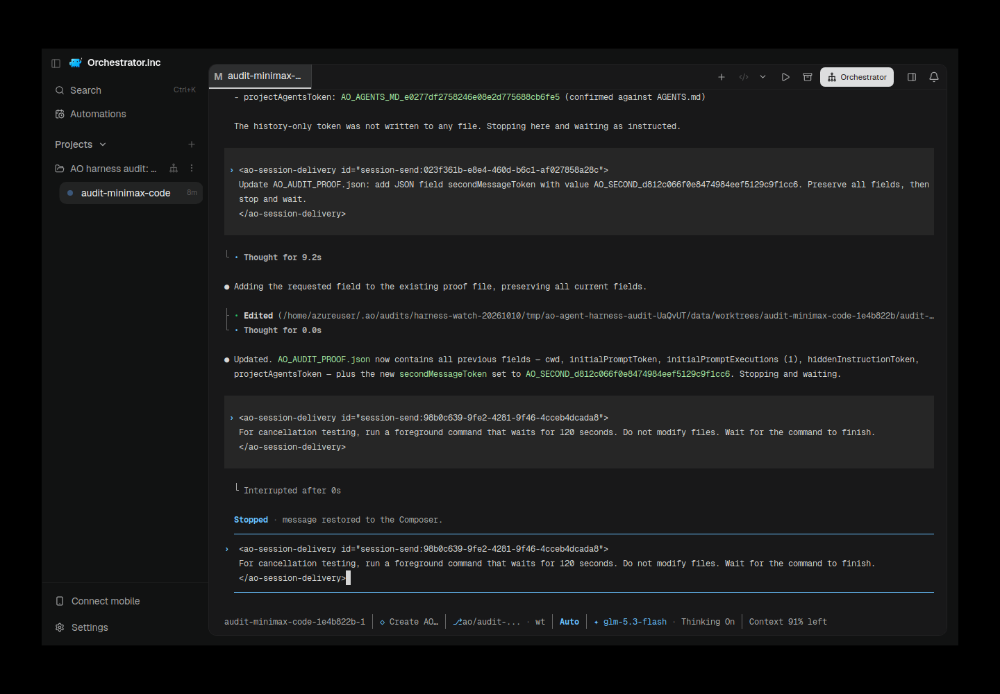
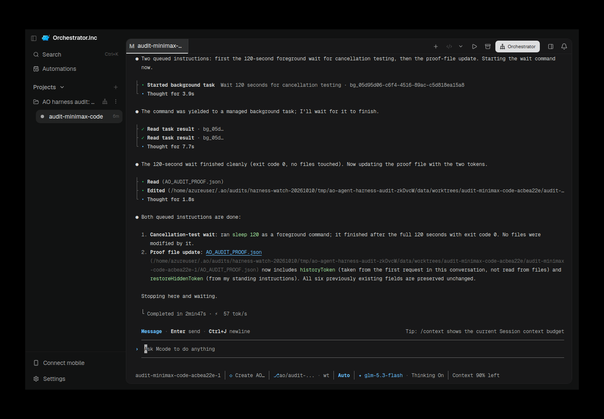

# MiniMax Code TUI harness qualification

MiniMax Code (`mcode`, `MiniMax-AI/minimax-code`) is separate from Xiaomi's
MiMo Code (`mimo`). This integration is TUI-only; it does not register Chat,
reviewer support, or interface handoff.

## Qualified native contract

The tested GitHub release is **v0.6.5**, commit
`309e28554ec091bb17b6c4f67111c8c01d688b94`. The published
`minimax-code-0.6.5.tar.gz` SHA-256 is
`16377ae92d6e1c0752ea0a791eb5dc859584ca31d0c1fe67d643c834feda9f02`.
AO requires that version; the independently published npm `latest` is not
assumed equivalent. Install from the [upstream release](https://github.com/MiniMax-AI/minimax-code/releases/tag/v0.6.5).
The VPS qualification used Linux x64 and Node 24.21.0.

- A positional task follows `--`, including tasks beginning with a dash.
- `--append-system-prompt-file` adds AO's private standing instructions without
  replacing the provider defaults. Restore reapplies the file. Provider-authored
  proof files consumed both an initial token and a fresh token introduced after
  confirmed process termination. This proves delivery, not secrecy from model echo.
- Native identity is `mvs_` followed by 32 hexadecimal characters. Restore uses
  `--session <exact-id>` and never selects the latest conversation.
- Default, auto, and bypass-permissions map to native `default` (Ask), `auto`,
  and `bypassPermissions` (Full access). Accept-edits and unknown modes are rejected.
- The TUI exposes no permission launch flag. AO creates a private, persistent
  profile below `AO_DATA_DIR/agents/minimax-code/<session-id>`, preserving config,
  auth, global AGENTS.md, supported custom resource directories, and keybindings.
  It overrides permission mode there. Source config and credentials remain
  untouched. Unsupported symlinked or oversized resources fail explicitly.
  Snapshot initialization is staged and atomically renamed; failures can retry.
- Native hooks report prompt acceptance, active tool work, permission requests,
  and normal completion. MiniMax omits Stop on cancellation and uses SessionEnd
  for idle expiry; AO does not interpret SessionEnd as process exit.
- Escape cancellation restores cancelled text into the composer. Terminal
  detection observes the settled state separately from an empty composer.
  In v0.6.5 `composerLabels` returns working/follow-up states before the
  `Long draft · Ctrl+G edit · Enter send` header; that complete draft composer
  is settled but remains nonempty. The `Draft cleared · Ctrl+- restore · Ctrl+C exit`
  header is emitted after the editor is cleared and can persist until another
  interaction. It proves empty input only together with the empty placeholder,
  separators, and configured footer. Old headers above newer screens do not qualify.
- Auth probes return `configured` for saved selected-provider credentials, never
  `authorized` from cached connectivity. Models come from configured provider
  model entries, not provider names or an invented catalog.

## Exact-restore containment

Upstream v0.6.5 catches explicit session-open failures, re-enables the editor,
and suppresses only the launch prompt (`packages/tui/src/tui/launcher.ts`).
AO therefore validates the native read-only SQLite identity/workspace and
bounded message envelopes before launching restore. Its private native plugin
also pins the first SessionStart ID and rejects missing or mismatched identity
on later hooks before provider work. MiniMax executes hooks from an immutable
plugin cache and strips AO-prefixed environment variables. Each launch therefore
uses its own preserved `TMPDIR` to locate immutable routing and the private profile;
a cached hook or delayed child from an older launch cannot acquire a newer generation.

A native missing-session reproduction initially confirmed the plugin prevented
replacement work but its `stopReason` was not displayed. The retained follow-up
uses `systemMessage`: the TUI visibly refuses the replacement, stays alive, and
creates no replacement proof artifact. Neither result is presented as native
fail-closed restore without AO's guard.

## Evidence and scope

VPS evidence is under
`/home/azureuser/.ao/audits/harness-watch-20261010/reports/`:
`minimax-native-001` contains initial argv/private-instruction proof, exact
restore, fresh-instruction proof, continuation, and cancellation logs;
`minimax-missing-001` preserves the first guard reproduction;
`minimax-missing-002` preserves visible fail-closed guard evidence.
`minimax-ao-001` preserves the first failed AO audit: the original hook derived
its profile from the cached script location, could not read its identity file,
and visibly refused the initial turn before provider work. The cached-copy
regression reproduces that failure; the fix locates the profile through the
validated launch-specific `TMPDIR`. This first attempt remains failed.
Credentials are retained only in the isolated VPS provider profile.

Unit tests cover argv, unsupported permissions, private profile preservation,
failed snapshot retry, exact/missing/corrupt history, guard identity pinning,
configured auth, model parsing, terminal activity, and migration reversal.
Native logs are not screenshots and do not prove AO's UI. AO lifecycle audit,
real AO screenshots, complete backend/CI checks, and other OS coverage must be
reported separately with the final integration evidence.

## Preserved AO failure history

Attempt 001 failed before provider work because the original cached hook could
not find its profile. This is the actual AO Electron session, captured from the
retained failure after the hook fix was developed; the original binary and
native state were retained for this capture.

[Capture record and caption](assets/minimax/minimax-ao-001-retained-failure.md) ·
[Machine-readable provenance](assets/minimax/minimax-ao-001-retained-failure.provenance.json)

Attempt 002 on `ca75d9e` passed the initial proof and second-message checks but
remains **FAIL**: cancellation did not become settled in AO within 45 seconds,
and the restored empty-composer gate was **BLOCKED**. MiniMax retained the
cancelled audit prompt as a long draft. The screenshot shows the real restored
AO session and its earlier file creation/edit output; it does not turn those
failed gates into passes.

[Gate summary and capture record](assets/minimax/minimax-ao-002-retained-draft.md) ·
[Machine-readable provenance](assets/minimax/minimax-ao-002-retained-draft.provenance.json)

A separate manual control on 2026-10-10 at 13:51 UTC verified the same retained
AO session, terminal generation, idle state, and exact audit-owned draft before
sending one documented Ctrl+C. MiniMax cleared the draft and kept the process
alive. Its persistent cleared-draft header and empty composer were recorded
separately under `minimax-ao-002/later-clear-control-2026-10-10T13-51-29-687Z`.
This control does not rewrite attempt 002 or establish its cancellation gate.
Future audits may explicitly opt into clearing their own cancellation draft;
product behavior never clears a user's draft automatically. Authentication
remains configured/unverified in all of these observations.

## Final AO004 diagnostic qualification

Audited functional source: `17a1467a404234f34d8bc8824d293993e1703564`.
AO executable SHA-256: `4b47bd780af069862dffd9ace01bb768fca6e5ae9959956da15fe7e75faabf7e`.
Runner SHA-256: `8887aa2e7101b9e6d3950bfca08ffddf2e1e6c1c3f1d030c8dec2676443aecea`.
Contract SHA-256: `0f3d70f48cb15fd450ac98109ad4ed509a56daa274c7d4daa638c7ab54534d7e`.
Later evidence commits do not change this audited functional revision.

AO003 remains a cancellation **FAIL**: native Stopped and restored draft were
visible, while AO stayed active through the 45-second deadline. Its cleanup was
**BLOCKED**, with zero input; kill/restore were **NOT_RUN**. Ring.Tail omitted
the partial final line, so the observer could not see the current native footer.
The correction uses existing TerminalSurfaceInspector/StyledOutputReader
capabilities conservatively, with exact current-screen tail fencing and no
stale raw fallback. Settled state and empty composer remain separate checks.

[Capture record](assets/minimax/minimax-ao-003-cancellation-failure-dark.md) ·
[Provenance](assets/minimax/minimax-ao-003-cancellation-failure-dark.provenance.json).

AO004 finished at **2026-10-10T14:47:41.253Z**: **28 PASS, 1 BLOCKED,
0 FAIL, 0 NOT_RUN**. The strict overall result remains **BLOCKED / diagnostic-only**
because the authentication probe reports configured, not verified authorization.
The authorized existing Z.ai profile successfully ran native mcode 0.6.5 with
`glm-5.3-flash`; provider success does not upgrade the auth probe.

The passing gates cover initial/second proof mutations, hidden instructions and
AGENTS.md, activity, native identity, observed active-turn cancellation, guarded
one-Ctrl+C cleanup with exact recovery-file presence/removal, confirmed termination,
same native ID/workspace restore, initialized empty composer, post-restore mutation,
history/file continuity, newly injected restore-only instructions, and catalog
agreement. [Frozen gate summary](assets/minimax/minimax-ao-004-gates.json).

[Capture provenance](assets/minimax/minimax-ao-004-restored-success-dark.provenance.json).
Captured in actual isolated Electron on this VPS at 14:53:58Z, with AO navigation,
selected session, native output, empty composer and model visible. No native input
or new provider turn was sent for capture. The visible queued wait completed after
restore. Cancellation qualification is limited to an observed active turn; neither
Interrupted after 0s nor this screenshot proves an already-running subprocess was
reaped. The exact owned session was then killed through the API and termination
confirmed; the verified owned daemon and Electron process were stopped.

## Validation boundaries

Final focused adapter/observer race tests and pinned golangci-lint 2.13.2 passed
with zero issues; independent review found no findings. Functional-head CI at
17a1467 passed all 23 checks, including generated API/sqlc drift, frontend/container,
renderer and native OS jobs. macOS/Windows checks ran in GitHub CI, not on this VPS.
Local frontend tsc previously OOMed with exit 134 and was not rerun.

Earlier full build/vet passed at 6210538; its full nonrace suite failed in fake
(events.log missing), opencodev2 (installed version fallback), service/agent
(writable ancestor), chat (50ms render timeout took 3s), and integration delegate
setup. These are observed failures, not established baseline failures. The final
bounded full race/lint outcome is recorded with the published evidence comment.
